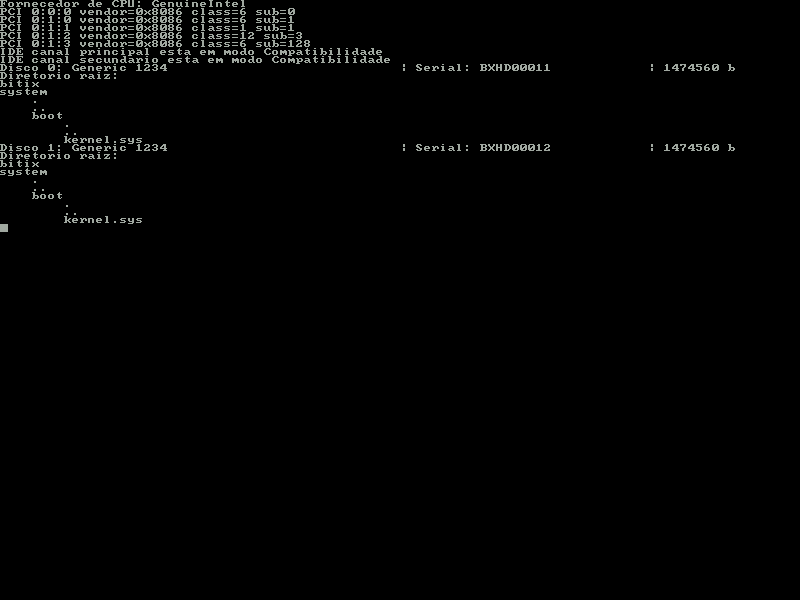

# Bitix

Bitix é um simples sistema operacional feito pra estudo.
Não crie muita expectativa.

*Print do estado atual*


## Dependencias
Aqui estão todos os comandos que ele usa:
- gcc
- ar
- objcopy
- nasm
- mkfs.fat
- mcopy
- python3
- make

## Como testar

Para compilar o projeto, use:
```bash
make
```

e para rodar use:

```bash
make qemu
```

## License
[MIT](LICENSE)
